# School-DOOMPY — Corrected & Complete UML Class Diagram

> **Audit notes** (corrections from v1):
> - Added missing `x`, `y` fields on `SpriteObject` and `Player`
> - Added missing hidden fields on `SpriteObject`: `dx`, `dy`, `theta`, `screen_x`, `dist`, `norm_dist`
> - Added `Game` instance fields for all subsystems (`map`, `player`, etc.) created in `new_game()`
> - Marked `pos`, `map_pos` as `«property»` on `Player` and `NPC`
> - `Weapon.update()` does NOT call `get_sprite()` — it only does `check_animation_time()` + `animate_shot()`
> - Added missing cross-class dependency arrows: `RayCasting → ObjectRenderer`, `NPC → PathFinding`, `Player → ObjectRenderer`, `Player → Sound`, `Player → Weapon`
> - `ObjectHandler.npc_positions` starts as `{}` dict, rewritten as set each `update()` tick
> - `PathFinding.get_path()` is `@lru_cache` decorated

```mermaid
classDiagram
    %% ─────────────────────────────────────────────
    %% CORE ENGINE
    %% ─────────────────────────────────────────────

    class Game {
        +screen
        +clock
        +delta_time : float
        +global_trigger : bool
        +global_event
        +map : Map
        +player : Player
        +object_renderer : ObjectRenderer
        +raycasting : RayCasting
        +object_handler : ObjectHandler
        +weapon : Weapon
        +sound : Sound
        +pathfinding : PathFinding
        +__init__()
        +new_game()
        +update()
        +draw()
        +check_events()
        +run()
    }

    class Map {
        +game
        +mini_map : list
        +world_map : dict
        +rows : int
        +cols : int
        +__init__(game)
        +get_map()
        +draw()
    }

    class Settings {
        <<module>>
        +RES
        +WIDTH, HEIGHT
        +HALF_WIDTH, HALF_HEIGHT
        +FPS
        +PLAYER_POS
        +PLAYER_ANGLE
        +PLAYER_SPEED
        +PLAYER_ROT_SPEED
        +PLAYER_SIZE_SCALE
        +PLAYER_MAX_HEALTH
        +MOUSE_SENSITIVITY
        +MOUSE_MAX_REL
        +MOUSE_BORDER_LEFT
        +MOUSE_BORDER_RIGHT
        +FLOOR_COLOR
        +FOV, HALF_FOV
        +NUM_RAYS, HALF_NUM_RAYS
        +DELTA_ANGLE
        +MAX_DEPTH
        +SCREEN_DIST
        +SCALE
        +TEXTURE_SIZE
        +HALF_TEXTURE_SIZE
    }

    %% ─────────────────────────────────────────────
    %% PLAYER
    %% ─────────────────────────────────────────────

    class Player {
        +game
        +x : float
        +y : float
        +angle : float
        +shot : bool
        +health : int
        +rel : int
        +health_recovery_delay : int
        +time_prev : int
        +diag_move_corr : float
        +__init__(game)
        +recover_health()
        +check_health_recovery_delay() bool
        +check_game_over()
        +get_damage(damage)
        +single_fire_event(event)
        +movement()
        +check_wall(x, y) bool
        +check_wall_collision(dx, dy)
        +draw()
        +mouse_control()
        +update()
        +«property» pos() tuple
        +«property» map_pos() tuple
    }

    %% ─────────────────────────────────────────────
    %% RENDERING
    %% ─────────────────────────────────────────────

    class RayCasting {
        +game
        +ray_casting_result : list
        +objects_to_render : list
        +textures : dict
        +__init__(game)
        +get_objects_to_render()
        +ray_cast()
        +update()
    }

    class ObjectRenderer {
        +game
        +screen
        +wall_textures : dict
        +sky_image
        +sky_offset : int
        +blood_screen
        +digit_size : int
        +digit_images : list
        +digits : dict
        +game_over_image
        +win_image
        +__init__(game)
        +draw()
        +win()
        +game_over()
        +draw_player_health()
        +player_damage()
        +draw_background()
        +render_game_objects()
        +get_texture(path, res)$
        +load_wall_textures() dict
    }

    %% ─────────────────────────────────────────────
    %% SPRITES
    %% ─────────────────────────────────────────────

    class SpriteObject {
        +game
        +player
        +x : float
        +y : float
        +image
        +IMAGE_WIDTH : int
        +IMAGE_HALF_WIDTH : int
        +IMAGE_RATIO : float
        +SPRITE_SCALE : float
        +SPRITE_HEIGHT_SHIFT : float
        +sprite_half_width : int
        +dx : float
        +dy : float
        +theta : float
        +screen_x : float
        +dist : float
        +norm_dist : float
        +__init__(game, path, pos, scale, shift)
        +get_sprite_projection()
        +get_sprite()
        +update()
    }

    class AnimatedSprite {
        +path : str
        +images : deque
        +animation_time : int
        +animation_time_prev : int
        +animation_trigger : bool
        +__init__(game, path, pos, scale, shift, animation_time)
        +update()
        +animate(images)
        +check_animation_time()
        +get_images(path) deque
    }

    class Weapon {
        +images : deque
        +weapon_pos : tuple
        +reloading : bool
        +num_images : int
        +frame_counter : int
        +damage : int
        +__init__(game, path, scale, animation_time)
        +animate_shot()
        +draw()
        +update()
    }

    %% ─────────────────────────────────────────────
    %% NPC HIERARCHY
    %% ─────────────────────────────────────────────

    class NPC {
        +size : int
        +health : int
        +attack_damage : int
        +attack_dist : int
        +speed : float
        +accuracy : float
        +alive : bool
        +pain : bool
        +ray_cast_value : bool
        +frame_counter : int
        +player_search_trigger : bool
        +idle_images : deque
        +walk_images : deque
        +attack_images : deque
        +pain_images : deque
        +death_images : deque
        +__init__(game, path, pos, scale, shift, animation_time)
        +update()
        +check_wall(x, y) bool
        +check_wall_collision(dx, dy)
        +movement()
        +attack()
        +animate_death()
        +animate_pain()
        +check_hit_in_npc()
        +check_health()
        +run_logic()
        +«property» map_pos() tuple
        +ray_cast_player_npc() bool
        +draw_ray_cast()
    }

    class SoldierNPC {
        %% Inherits all NPC defaults (soldier sprites)
        +__init__(game, path, pos, scale, shift, animation_time)
    }

    class CacoDemonNPC {
        +attack_dist : float
        +health : int
        +attack_damage : int
        +speed : float
        +accuracy : float
        +__init__(game, path, pos, scale, shift, animation_time)
    }

    class CyberDemonNPC {
        +attack_dist : int
        +health : int
        +attack_damage : int
        +speed : float
        +accuracy : float
        +__init__(game, path, pos, scale, shift, animation_time)
    }

    %% ─────────────────────────────────────────────
    %% OBJECT MANAGEMENT
    %% ─────────────────────────────────────────────

    class ObjectHandler {
        +game
        +sprite_list : list
        +npc_list : list
        +npc_sprite_path : str
        +static_sprite_path : str
        +anim_sprite_path : str
        +enemies : int
        +npc_types : list
        +weights : list
        +restricted_area : set
        +npc_positions : set
        +__init__(game)
        +spawn_npc()
        +check_win()
        +update()
        +add_npc(npc)
        +add_sprite(sprite)
    }

    %% ─────────────────────────────────────────────
    %% PATHFINDING
    %% ─────────────────────────────────────────────

    class PathFinding {
        +game
        +map : list
        +ways : list
        +graph : dict
        +__init__(game)
        +«lru_cache» get_path(start, goal) tuple
        +bfs(start, goal, graph) dict
        +get_next_nodes(x, y) list
        +get_graph()
    }

    %% ─────────────────────────────────────────────
    %% SOUND
    %% ─────────────────────────────────────────────

    class Sound {
        +game
        +path : str
        +theme
        +shotgun
        +npc_pain
        +npc_death
        +npc_shot
        +player_pain
        +__init__(game)
    }

    %% ═══════════════════════════════════════════════
    %% INHERITANCE
    %% ═══════════════════════════════════════════════

    SpriteObject <|-- AnimatedSprite
    AnimatedSprite <|-- NPC
    AnimatedSprite <|-- Weapon
    NPC <|-- SoldierNPC
    NPC <|-- CacoDemonNPC
    NPC <|-- CyberDemonNPC

    %% ═══════════════════════════════════════════════
    %% COMPOSITION (Game owns subsystems)
    %% ═══════════════════════════════════════════════

    Game *-- Map : owns
    Game *-- Player : owns
    Game *-- ObjectRenderer : owns
    Game *-- RayCasting : owns
    Game *-- ObjectHandler : owns
    Game *-- Weapon : owns
    Game *-- Sound : owns
    Game *-- PathFinding : owns

    %% ═══════════════════════════════════════════════
    %% AGGREGATION (ObjectHandler manages collections)
    %% ═══════════════════════════════════════════════

    ObjectHandler o-- SpriteObject : sprite_list
    ObjectHandler o-- NPC : npc_list

    %% ═══════════════════════════════════════════════
    %% CROSS-CLASS DEPENDENCIES (runtime calls)
    %% ═══════════════════════════════════════════════

    RayCasting ..> ObjectRenderer : reads wall_textures
    RayCasting ..> Map : reads world_map
    RayCasting ..> Player : reads pos / angle

    Player ..> ObjectRenderer : calls game_over / player_damage
    Player ..> Sound : plays player_pain / shotgun
    Player ..> Weapon : sets reloading
    Player ..> Map : calls world_map for collision

    NPC ..> PathFinding : calls get_path()
    NPC ..> Player : reads pos / shot / get_damage()
    NPC ..> Sound : plays npc_pain / npc_death / npc_shot
    NPC ..> Weapon : reads damage
    NPC ..> Map : reads world_map for wall checks
    NPC ..> ObjectHandler : reads npc_positions

    ObjectHandler ..> ObjectRenderer : calls win()
    ObjectRenderer ..> RayCasting : reads objects_to_render

    PathFinding ..> Map : reads mini_map / world_map
    PathFinding ..> ObjectHandler : reads npc_positions (BFS avoidance)
```

