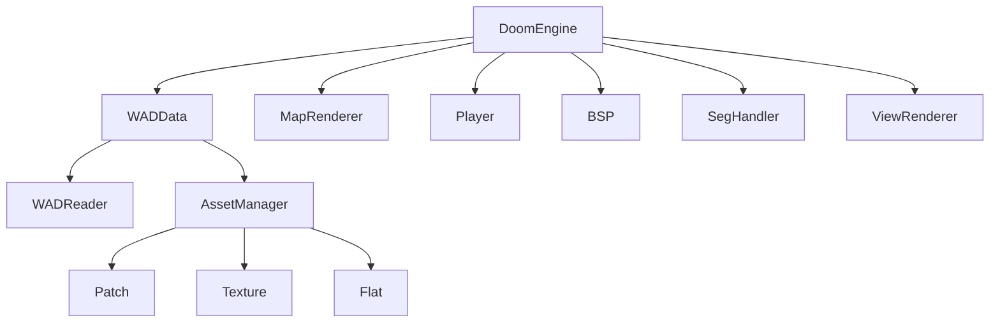
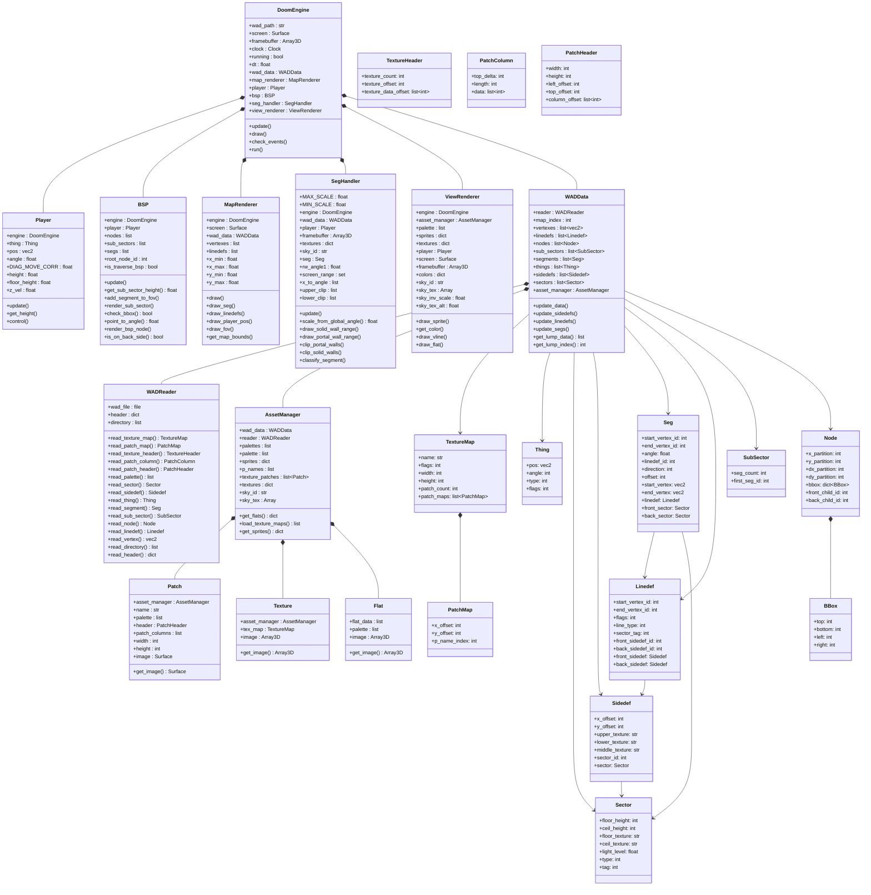

# School-DOOMPY UML Diagrams

```mermaid
graph TD
    DE[DoomEngine] --> WD[WADData]
    DE --> MR[MapRenderer]
    DE --> PL[Player]
    DE --> BSP_Tree[BSP]
    DE --> SH[SegHandler]
    DE --> VR[ViewRenderer]
    
    WD --> WR[WADReader]
    WD --> AM[AssetManager]
    
    AM --> PA[Patch]
    AM --> TX[Texture]
    AM --> FL[Flat]
```

```mermaid
classDiagram
    %% Core Engine
    class DoomEngine {
        +wad_path : str
        +screen : Surface
        +framebuffer : Array3D
        +clock : Clock
        +running : bool
        +dt : float
        +wad_data : WADData
        +map_renderer : MapRenderer
        +player : Player
        +bsp : BSP
        +seg_handler : SegHandler
        +view_renderer : ViewRenderer
        +update()
        +draw()
        +check_events()
        +run()
    }

    class Player {
        +engine : DoomEngine
        +thing : Thing
        +pos : vec2
        +angle : float
        +DIAG_MOVE_CORR : float
        +height : float
        +floor_height : float
        +z_vel : float
        +update()
        +get_height()
        +control()
    }

    class BSP {
        +engine : DoomEngine
        +player : Player
        +nodes : list
        +sub_sectors : list
        +segs : list
        +root_node_id : int
        +is_traverse_bsp : bool
        +update()
        +get_sub_sector_height() float
        +add_segment_to_fov()
        +render_sub_sector()
        +check_bbox() bool
        +point_to_angle() float
        +render_bsp_node()
        +is_on_back_side() bool
    }

    class MapRenderer {
        +engine : DoomEngine
        +screen : Surface
        +wad_data : WADData
        +vertexes : list
        +linedefs : list
        +x_min : float
        +x_max : float
        +y_min : float
        +y_max : float
        +draw()
        +draw_seg()
        +draw_linedefs()
        +draw_player_pos()
        +draw_fov()
        +get_map_bounds()
    }

    class SegHandler {
        +MAX_SCALE : float
        +MIN_SCALE : float
        +engine : DoomEngine
        +wad_data : WADData
        +player : Player
        +framebuffer : Array3D
        +textures : dict
        +sky_id : str
        +seg : Seg
        +rw_angle1 : float
        +screen_range : set
        +x_to_angle : list
        +upper_clip : list
        +lower_clip : list
        +update()
        +scale_from_global_angle() float
        +draw_solid_wall_range()
        +draw_portal_wall_range()
        +clip_portal_walls()
        +clip_solid_walls()
        +classify_segment()
    }

    class ViewRenderer {
        +engine : DoomEngine
        +asset_manager : AssetManager
        +palette : list
        +sprites : dict
        +textures : dict
        +player : Player
        +screen : Surface
        +framebuffer : Array3D
        +colors : dict
        +sky_id : str
        +sky_tex : Array
        +sky_inv_scale : float
        +sky_tex_alt : float
        +draw_sprite()
        +get_color()
        +draw_vline()
        +draw_flat()
    }

    %% WAD Parsing
    class WADData {
        +reader : WADReader
        +map_index : int
        +vertexes : list~vec2~
        +linedefs : list~Linedef~
        +nodes : list~Node~
        +sub_sectors : list~SubSector~
        +segments : list~Seg~
        +things : list~Thing~
        +sidedefs : list~Sidedef~
        +sectors : list~Sector~
        +asset_manager : AssetManager
        +update_data()
        +update_sidedefs()
        +update_linedefs()
        +update_segs()
        +get_lump_data() list
        +get_lump_index() int
    }

    class WADReader {
        +wad_file : file
        +header : dict
        +directory : list
        +read_texture_map() TextureMap
        +read_patch_map() PatchMap
        +read_texture_header() TextureHeader
        +read_patch_column() PatchColumn
        +read_patch_header() PatchHeader
        +read_palette() list
        +read_sector() Sector
        +read_sidedef() Sidedef
        +read_thing() Thing
        +read_segment() Seg
        +read_sub_sector() SubSector
        +read_node() Node
        +read_linedef() Linedef
        +read_vertex() vec2
        +read_directory() list
        +read_header() dict
    }

    class AssetManager {
        +wad_data : WADData
        +reader : WADReader
        +palettes : list
        +palette : list
        +sprites : dict
        +p_names : list
        +texture_patches : list~Patch~
        +textures : dict
        +sky_id : str
        +sky_tex : Array
        +get_flats() dict
        +load_texture_maps() list
        +get_sprites() dict
    }

    class Patch {
        +asset_manager : AssetManager
        +name : str
        +palette : list
        +header : PatchHeader
        +patch_columns : list
        +width : int
        +height : int
        +image : Surface
        +get_image() Surface
    }

    class Texture {
        +asset_manager : AssetManager
        +tex_map : TextureMap
        +image : Array3D
        +get_image() Array3D
    }

    class Flat {
        +flat_data : list
        +palette : list
        +image : Array3D
        +get_image() Array3D
    }

    %% DOOM Native Types
    class TextureMap {
        +name: str
        +flags: int
        +width: int
        +height: int
        +patch_count: int
        +patch_maps: list~PatchMap~
    }

    class PatchMap {
        +x_offset: int
        +y_offset: int
        +p_name_index: int
    }

    class TextureHeader {
        +texture_count: int
        +texture_offset: int
        +texture_data_offset: list~int~
    }

    class PatchColumn {
        +top_delta: int
        +length: int
        +data: list~int~
    }

    class PatchHeader {
        +width: int
        +height: int
        +left_offset: int
        +top_offset: int
        +column_offset: list~int~
    }

    class Thing {
        +pos: vec2
        +angle: int
        +type: int
        +flags: int
    }

    class Sector {
        +floor_height: int
        +ceil_height: int
        +floor_texture: str
        +ceil_texture: str
        +light_level: float
        +type: int
        +tag: int
    }

    class Sidedef {
        +x_offset: int
        +y_offset: int
        +upper_texture: str
        +lower_texture: str
        +middle_texture: str
        +sector_id: int
        +sector: Sector
    }

    class Seg {
        +start_vertex_id: int
        +end_vertex_id: int
        +angle: float
        +linedef_id: int
        +direction: int
        +offset: int
        +start_vertex: vec2
        +end_vertex: vec2
        +linedef: Linedef
        +front_sector: Sector
        +back_sector: Sector
    }

    class Linedef {
        +start_vertex_id: int
        +end_vertex_id: int
        +flags: int
        +line_type: int
        +sector_tag: int
        +front_sidedef_id: int
        +back_sidedef_id: int
        +front_sidedef: Sidedef
        +back_sidedef: Sidedef
    }

    class SubSector {
        +seg_count: int
        +first_seg_id: int
    }

    class Node {
        +x_partition: int
        +y_partition: int
        +dx_partition: int
        +dy_partition: int
        +bbox: dict~BBox~
        +front_child_id: int
        +back_child_id: int
    }

    class BBox {
        +top: int
        +bottom: int
        +left: int
        +right: int
    }

    %% Main Relations
    DoomEngine *-- Player
    DoomEngine *-- BSP
    DoomEngine *-- MapRenderer
    DoomEngine *-- SegHandler
    DoomEngine *-- ViewRenderer
    DoomEngine *-- WADData
    
    WADData *-- WADReader
    WADData *-- AssetManager
    
    AssetManager *-- Patch
    AssetManager *-- Texture
    AssetManager *-- Flat

    TextureMap *-- PatchMap
    Sidedef --> Sector
    Seg --> Linedef
    Seg --> Sector
    Linedef --> Sidedef
    Node *-- BBox
    
    WADData --> TextureMap
    WADData --> Thing
    WADData --> Sector
    WADData --> Sidedef
    WADData --> Seg
    WADData --> Linedef
    WADData --> SubSector
    WADData --> Node
```

